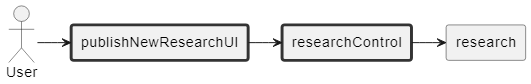

Logo

Integrantes:
- Kevin Villegas
- Diego de León
- Andrea Diaz
- Juan Belisario
- Carlos Arena

Modelo de Dominio

- Diagrama de Clases

- Diagrama de Estados

- Diagrama de Casos de Uso

- Prototipo de Pantallas
| Iniciar Sesión |

| Registrarse |

| Tablón de Anuncio |

| Mostrar Calendario |

| Publicar Evento |

| Publicar Investigación |

| Editar Perfil |

- Diagrama de Analisis
| Login |

| Register |

| Show Notification |

| Show Calendary |

| Add Event |

| Create Event |

| Publish Reseach |

| Edit Account |

| Edit Event |

- Diagrama de Colaboracion
| Login |

| Register |

| Show Notification |

| Show Calendary |

| Add Event |

| Create Event |

| Publish Reseach |

| Edit Account |

| Edit Event |

- Diagrama de Clases de Analisis

- Diagrama de Paquetes de Analisis

- Diagrama Caso de Uso Representativo

Secuencia:

Traza:

Diagrama de Despliegue:

Modelo de Implementación:
Las librerias utilizadas son:
java.awt.BorderLayout;
java.awt.Color;
java.awt.Component;
java.awt.Dimension;
java.awt.FlowLayout;
java.awt.Font;
java.awt.event.ActionEvent;
java.awt.event.ActionListener;
java.io.BufferedReader;
java.io.File;
java.io.FileReader;
java.io.FileWriter;
java.io.IOException;
java.io.PrintWriter;
java.util.ArrayList;
java.util.List;
En la carpeta src/interfaces se encuentran las interfaces